# Memory Scramble - Laboratory Report

## Aim of the Laboratory

This laboratory implements **Memory Scramble**, a concurrent multiplayer variant of the classic Memory/Concentration card-matching game. The project demonstrates advanced software construction principles including:

- **Concurrent programming** with thread-safe mutable ADTs
- **Asynchronous operations** with promises and deferred execution
- **Network protocols** using HTTP RESTful APIs
- **Event-driven architecture** with long-polling for real-time updates
- **Functional programming** with higher-order functions (map operations)

Unlike traditional Memory games where players take turns, Memory Scramble allows multiple players to flip cards simultaneously, requiring careful synchronization and concurrency control to maintain game state consistency.

**Implementation:** This project is implemented in **C# 9.0** using **.NET 9.0** and ASP.NET Core for the web server.

---

## Project Structure

```
PR-lab3-MemoryScramble/
├── MemoryScramble.API/              # Main game server application
│   ├── Board.cs                     # Core game board ADT with concurrency support
│   ├── Commands.cs                  # API command handlers (look, flip, map, watch)
│   ├── Program.cs                   # Web server entry point and endpoint configuration
│   ├── Boards/                      # Board configuration files
│   │   ├── 10x10.txt               # Default 10×10 game board
│   │   ├── test.txt                # Small test board
│   │   ├── mega.txt                # Large board for stress testing
│   │   └── another.txt             # Additional board configuration
│   ├── Exceptions/                  # Custom game exceptions
│   │   ├── CardAlreadyControlled.cs
│   │   ├── FlipException.cs
│   │   ├── InvalidCardFormatException.cs
│   │   ├── InvalidGridFormatException.cs
│   │   ├── InvalidGridSizeFormatException.cs
│   │   ├── InvalidRowColumnValueException.cs
│   │   ├── MismatchedCardCountException.cs
│   │   └── NoCardAtPositionException.cs
│   ├── TaskSchedulers/              # Background services for Host environment
│   │   ├── GameResetScheduler.cs   # Periodic board reset (every 5 minutes)
│   │   └── HealthCheckScheduler.cs # Keep-alive pings (every 13 minutes)
│   ├── wwwroot/                     # Static web client files
│   │   └── index.html              # Browser-based game interface
│   ├── appsettings.json            # General application configuration
│   ├── appsettings.Development.json
│   ├── appsettings.Host.json       # Production environment settings
│   └── Properties/
│       └── launchSettings.json     # Launch profiles (Development, Release, Host)
├── MemoryScramble.UnitTests/        # Comprehensive test suite (65 tests)
│   ├── BoardParseFromFileTests.cs  # Board file parsing tests (6 tests)
│   ├── BoardMapTests.cs            # Map operation tests (5 tests)
│   ├── BoardFlipTests.cs           # Card flipping rules tests (15 tests)
│   ├── BoardViewByTests.cs         # Board state viewing tests (9 tests)
│   ├── BoardWatchTests.cs          # Change notification tests (8 tests)
│   ├── BoardResetTests.cs          # Board reset functionality tests (15 tests)
│   └── TestingBoards/              # Test board configurations
│       ├── Valid/                  # Valid board files
│       ├── WithInvalidCards/       # Invalid card format tests
│       ├── WithInvalidRowColumnValue/
│       ├── WithInvalidSizeFormat/
│       └── WithMismatchedCardCount/
├── MemoryScramble.Simulation/       # Concurrent player simulation
│   ├── Program.cs                  # Simulation runner
│   └── SimulationBoards/           # Boards for simulation testing
│       └── test.txt
├── Dockerfile                       # Docker containerization
├── docker-compose.yml              # Docker orchestration
├── .dockerignore                   # Docker build exclusions
└── PR-lab3-MemoryScramble.sln     # Visual Studio solution file
```

### Key Files Explained

- **Board.cs**: The heart of the application. Implements a thread-safe, concurrent mutable ADT representing the game board. Uses `SemaphoreSlim` for mutual exclusion and `Deferred<T>` promises for asynchronous waiting. Includes complete AF, RI, SRE documentation and `CheckRep()` validation.

- **Commands.cs**: Thin glue layer between HTTP endpoints and Board operations. Implements `Look()`, `Flip()`, `Map()`, and `Watch()` commands per the 6.102 specification.

- **Program.cs**: ASP.NET Core web server configuration. Defines HTTP endpoints, CORS policy, static file serving, and environment-specific schedulers.

- **Deferred<T>**: Custom promise implementation for coordinating asynchronous operations, particularly for implementing Rule 1-D (waiting for card control).

---

## Docker Configuration

### Dockerfile

The Dockerfile uses a single-stage build with the .NET SDK to run the application directly:

```dockerfile
FROM mcr.microsoft.com/dotnet/sdk:9.0-alpine
WORKDIR /app

COPY MemoryScramble.API/MemoryScramble.API.csproj ./MemoryScramble.API/
RUN dotnet restore MemoryScramble.API/MemoryScramble.API.csproj

COPY MemoryScramble.API/ ./MemoryScramble.API/

EXPOSE 8080

ENTRYPOINT ["dotnet", "run", "--project", "MemoryScramble.API/MemoryScramble.API.csproj", "--launch-profile", "Host"]
```

**Key features:**
- Uses Alpine Linux base image for minimal size
- Restores dependencies first (layer caching optimization)
- Runs with `dotnet run` using the Host launch profile
- Exposes port 8080 for HTTP traffic
- Default environment: **Host** (includes GameResetScheduler and HealthCheckScheduler)

### docker-compose.yml

Simple orchestration configuration:

```yaml
services:
  memory-scramble-app:
    image: memory-scramble:latest
    build:
      context: .
      dockerfile: Dockerfile
    ports:
      - "8080:8080"
    restart: unless-stopped
```

**Features:**
- Builds image tagged as `memory-scramble:latest`
- Maps container port 8080 to host port 8080
- Auto-restart policy for reliability
- No volume mounts (board files baked into image)

---

## How to Run the Game Server

### Option 1: Docker Compose (Recommended for Production)

```powershell
# Build and run in detached mode
docker-compose up -d

# View logs
docker-compose logs -f

# Stop the server
docker-compose down
```

The server will run in **Host** environment mode with:
- Automatic board resets every 5 minutes
- Health check pings every 13 minutes (prevents sleeping on Render)
- HTTPS redirection enabled

**Access the game:** Open `http://localhost:8080` in your browser

### Option 2: Local Development

Run with default settings (Development profile):
```powershell
dotnet run --project .\MemoryScramble.API\
```

Run with specific launch profile:
```powershell
# Release profile (optimized, no schedulers)
dotnet run --project .\MemoryScramble.API\ -lp Release

# Host profile (production mode with schedulers)
dotnet run --project .\MemoryScramble.API\ -lp Host
```

**Launch Profiles:**
- **Development**: Port 5253, detailed logging, no HTTPS redirection
- **Release**: Port 5253, optimized build, no background schedulers
- **Host**: Port 8080, HTTPS redirection, GameResetScheduler, HealthCheckScheduler

**Configuration:** Edit `appsettings.json` to change the default board file:
```json
{
  "BoardFile": "10x10.txt"  // Change to "test.txt", "mega.txt", etc.
}
```

---

## Testing

### What Was Tested

The test suite covers all aspects of the Memory Scramble game with **65 comprehensive tests**:

#### 1. **Board Parsing Tests** (6 tests)
- Valid board file parsing (1×1, 2×2, 3×3, 4×1, 5×5 grids)
- Invalid format detection:
  - Missing or malformed grid header
  - Invalid row/column values
  - Card count mismatch
  - Invalid card formats (whitespace, empty strings)

#### 2. **Flip Operation Tests** (15 tests)
Validates all game rules (1-A through 3-B):
- **Rule 1-A**: Flipping empty space throws `NoCardAtPositionException`
- **Rule 1-B**: First card turns face up, player gains control
- **Rule 1-C**: Taking control of already face-up card
- **Rule 1-D**: Waiting for card controlled by another player
- **Rule 2-A/B**: Second card failure scenarios
- **Rule 2-C**: Second card turns face up
- **Rule 2-D**: Matching cards - player keeps control
- **Rule 2-E**: Non-matching cards - player relinquishes control
- **Rule 3-A**: Matched cards removed on next move
- **Rule 3-B**: Non-matched cards turn face down (if not controlled)

#### 3. **ViewBy Tests** (9 tests)
- Correct board state representation
- Face-down cards shown as "down"
- Face-up cards shown as "up CARD"
- Controlled cards shown as "my CARD"
- Empty spaces shown as "none"
- Multi-player perspective correctness

#### 4. **Map Tests** (5 tests)
- Card replacement with transformer function
- Asynchronous transformation handling
- Atomicity of replacements per card value
- Face-up/face-down state preservation
- Concurrent map operations

#### 5. **Watch Tests** (8 tests)
- Notification on card state changes
- No notification on control-only changes
- Multiple concurrent watchers
- Watcher cleanup after notification
- Long-polling behavior

#### 6. **Reset Tests** (15 tests)
- Board restoration to initial state
- All cards face down after reset
- Player control cleared
- Waiting operations rejected
- Watchers notified of reset

### Running Tests

```powershell
# Run all tests
dotnet test

# Run with detailed output
dotnet test --logger "console;verbosity=detailed"

# Run specific test file
dotnet test --filter "FullyQualifiedName~BoardFlipTests"

# Run with coverage (if configured)
dotnet test --collect:"XPlat Code Coverage"
```

### Test Results

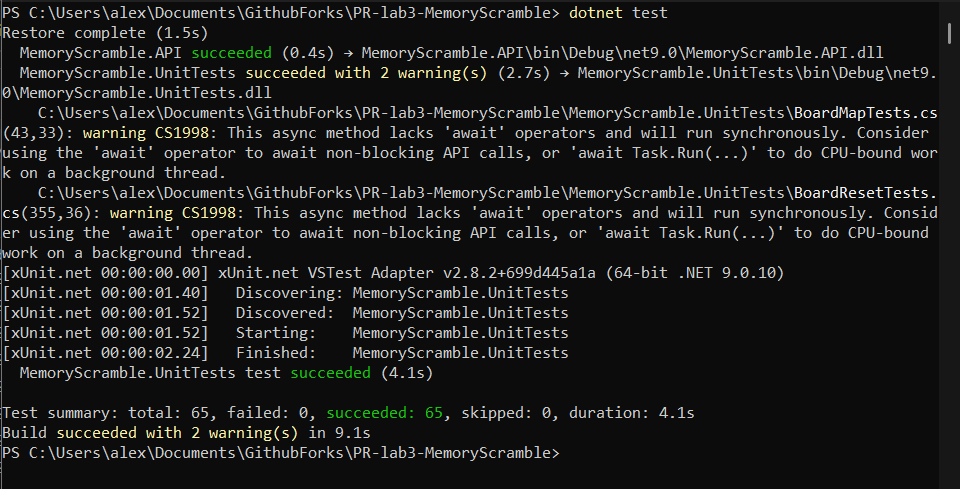

**All 65 tests passing** ✅
- 0 failed
- 0 skipped
- Test execution time: ~4.1 seconds

---

## Simulation

### How It Works

The simulation demonstrates correct concurrent behavior by running **4 players** simultaneously making **random moves** with **random timeouts** on a large board. This satisfies the 4-point simulation requirement:

**Requirements (from 6.102):**
- ✅ 4 concurrent players
- ✅ Random timeouts between 0.1ms and 2ms  
- ✅ No shuffling (deterministic board layout)
- ✅ 100 moves per player (400 total moves)
- ✅ Game never crashes

**Implementation Details:**

```csharp
// From MemoryScramble.Simulation/Program.cs
const int PLAYERS = 4;
const int MOVES_PER_PLAYER = 100;
const double MIN_TIMEOUT_MS = 0.1;
const double MAX_TIMEOUT_MS = 2.0;
```

Each player:
1. Randomly selects a card position
2. Attempts to flip it (may wait if controlled)
3. If successful, randomly selects a second card
4. Waits a random duration before next move
5. Repeats for 100 moves

The simulation logs:
- Each flip attempt (first/second card)
- Successful matches (cards removed)
- Failed attempts (no card, already controlled)
- Final board state showing remaining cards

### Running the Simulation

```powershell
# Navigate to simulation project
cd MemoryScramble.Simulation

# Run simulation
dotnet run

# Or from solution root
dotnet run --project .\MemoryScramble.Simulation\
```

### Simulation Results

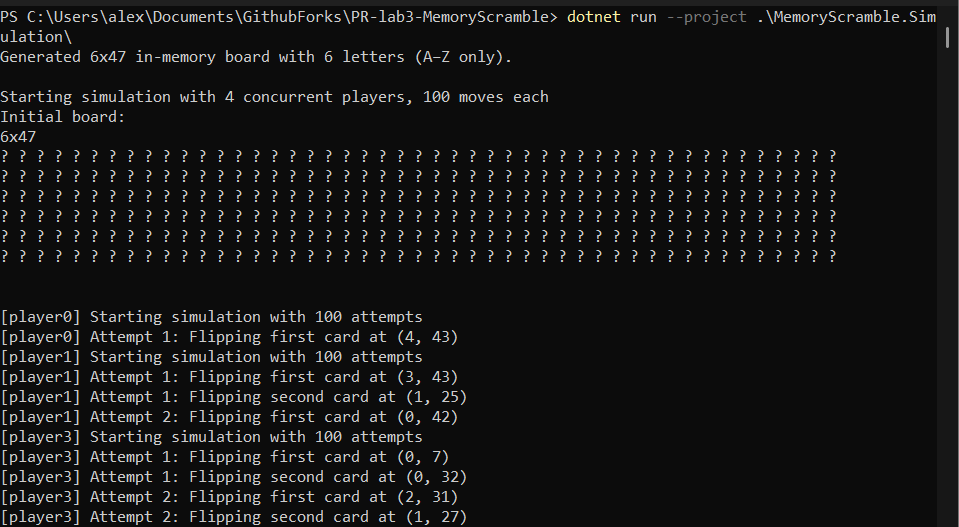
*Simulation initialization and first moves showing concurrent player interactions*

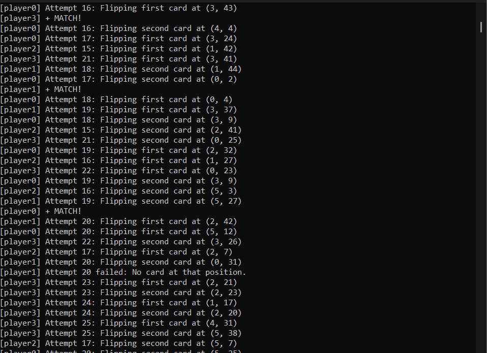
*Final board state after 400 moves (no crashes) - all players completed successfully*

**Key Observations:**
- All 400 moves completed successfully
- No deadlocks or race conditions
- Proper waiting behavior (Rule 1-D)
- Correct card removal on matches
- Final board shows cards face down with some removed

---

## Game Rules Implementation

Memory Scramble implements a concurrent version of the classic Memory card game with specific rules for handling simultaneous player actions.

### First Card Rules (1-A through 1-D)

**Rule 1-A: No Card at Position**

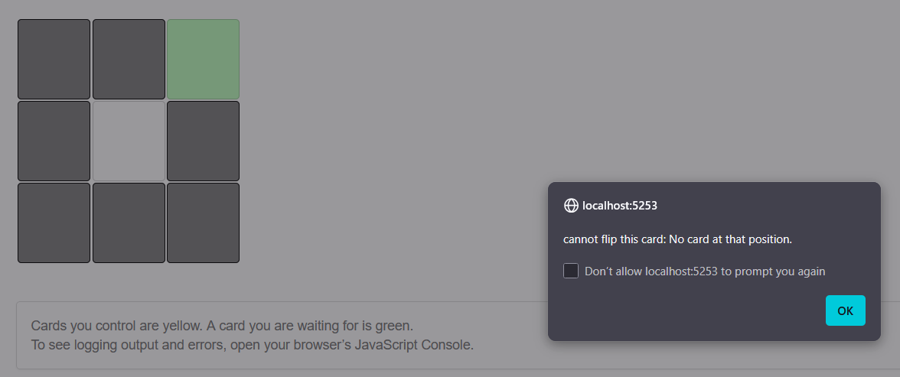
*Player tries to flip an empty space - operation fails with NoCardAtPositionException*

```csharp
if (cell.Card == null)
    throw new NoCardAtPositionException();
```
If a player tries to flip an empty space, the operation fails immediately.

**Rule 1-B: Face-Down Card**

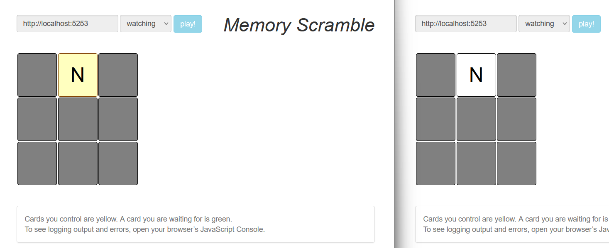
*Player on left flips a face-down card, turns it face up and gains control. Player on right sees it as face up.*

```csharp
if (!cell.IsUp && cell.Card != null)
{
    cell.TurnUp();
    TakeControl(playerId, pos);
}
```
The card turns face up and the player gains control. All other players can now see the card.

**Rule 1-C: Face-Up Uncontrolled Card**

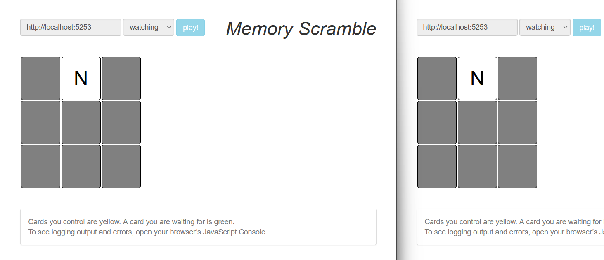
*Card is face up but not controlled by anyone*

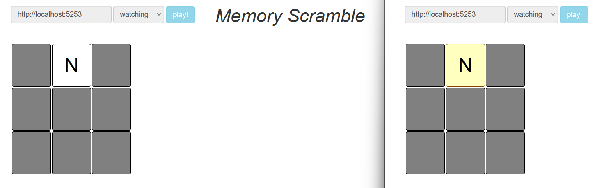
*Player on right decides to take control of the uncontrolled face-up card*

```csharp
if (cell.IsUp && !IsControlled(pos))
{
    TakeControl(playerId, pos);
}
```
The player takes control of an already visible card without changing its face-up state.

**Rule 1-D: Waiting for Controlled Card**

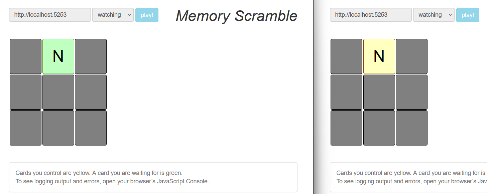
*Player on right (yellow) owns a card. Player on left tries to flip it and waits (shown in green) until control is released.*

```csharp
while (IsControlled(pos) && !IsControlledBy(pos, playerId))
{
    var hold = new Deferred<object?>();
    _holds[pos].Add(hold);
    
    _lock.Release();
    await hold.Task;  // Wait for control to be released
    await _lock.WaitAsync();
}
```
If another player controls the card, this player waits asynchronously. Multiple players may queue to control the same card. When the current controller releases the card, one waiting player is notified via promise resolution.

### Second Card Rules (2-A through 2-E)

**Rule 2-A: No Card (Failure)**

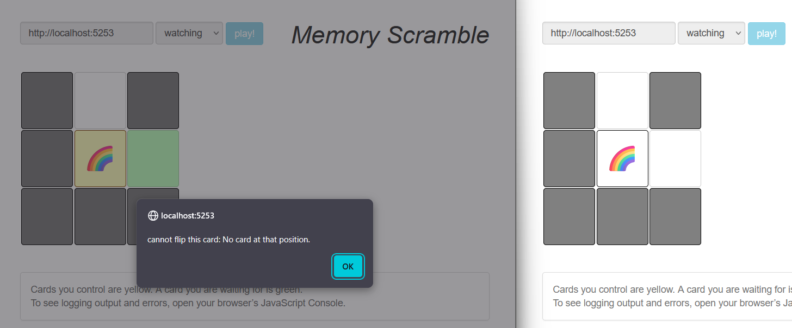
*Player on left tries to select an empty slot as second card and gets an error*

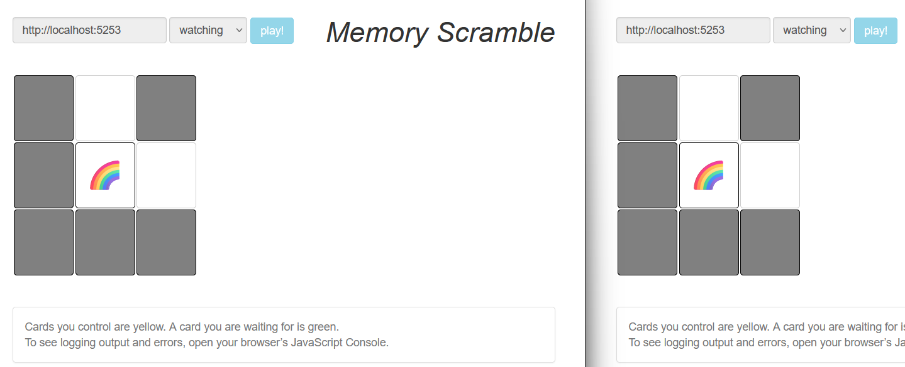
*Player on left gave up control of first card (it stays face up), player on right still sees it*

```csharp
if (cell.Card == null)
{
    GiveUpControl(firstPos, toResolve);
    throw new NoCardAtPositionException();
}
```
The player loses control of their first card (but it stays face up).

**Rule 2-B: Already Controlled (Failure)**

**Scenario 1: Trying to flip own first card as second card**

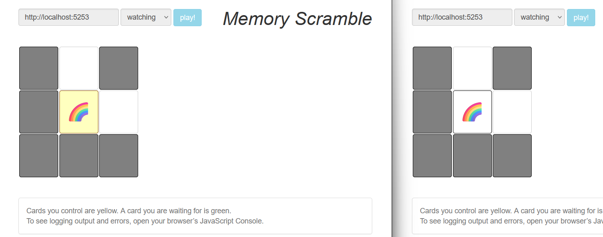
*Player on left controls their first card*

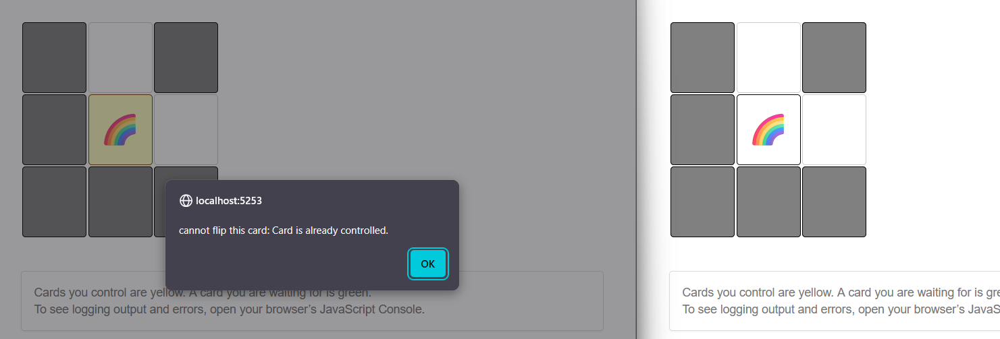
*Player tries to select their own controlled first card as second card - gets error*

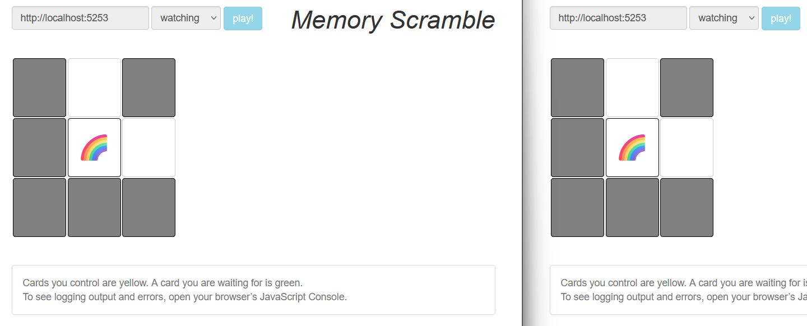
*Player loses control of the card, but it stays face up for both players*

**Scenario 2: Trying to flip another player's controlled card**

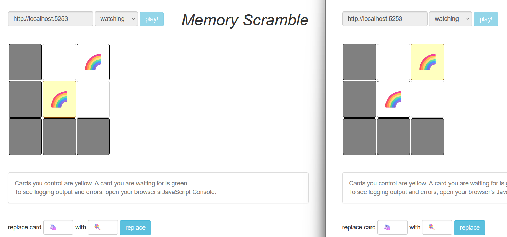
*Both players own a first card*

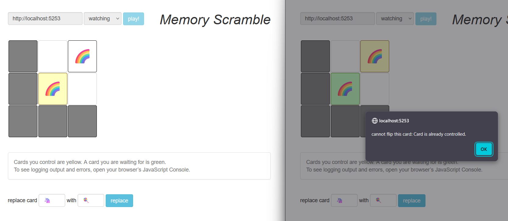
*Player on right tries to select as second card the first card controlled by player on left - gets error*

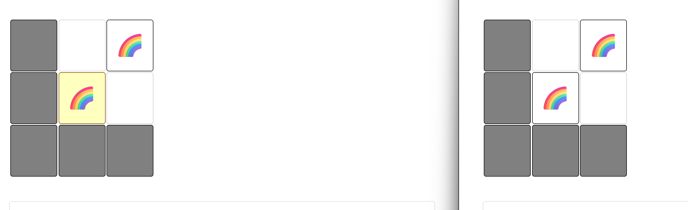
*Player on right loses control of their first card (stays up), player on left still owns their first card*

```csharp
if (IsControlled(pos))
{
    GiveUpControl(firstPos, toResolve);
    throw new CardAlreadyControlledException();
}
```
To prevent deadlocks, the operation does not wait. The player loses control of their first card.

**Rule 2-C: Turn Face Up**

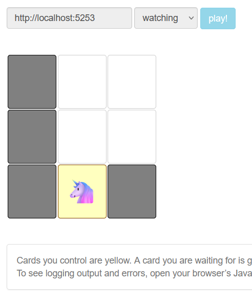
*Player has their first card selected and face up*

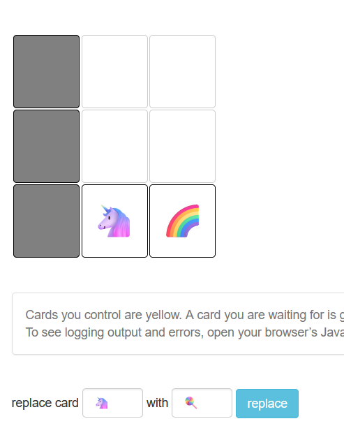
*Player selects a face-down second card - it turns face up*

```csharp
TurnUpIfNeeded(cell);  // If face down, turn face up
```

**Rule 2-D: Match - Keep Control**

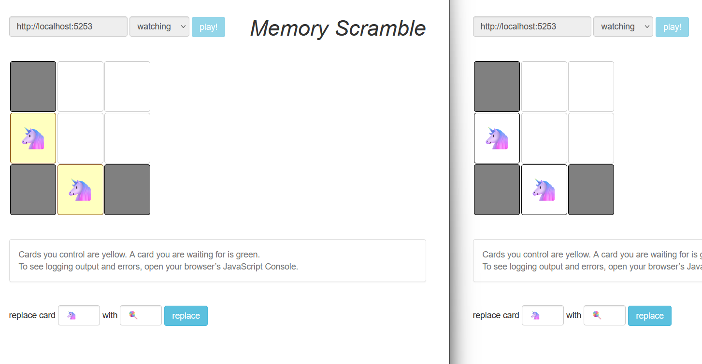
*Player on left's second card matches first card - player controls both cards*

```csharp
if (firstCell.Card == cell.Card)
{
    TakeControl(playerId, pos);  // Control both cards
    playerState.SetSecondCard(pos);
}
```
Both cards remain face up and controlled by the player until their next move.

**Rule 2-E: No Match - Relinquish Control**

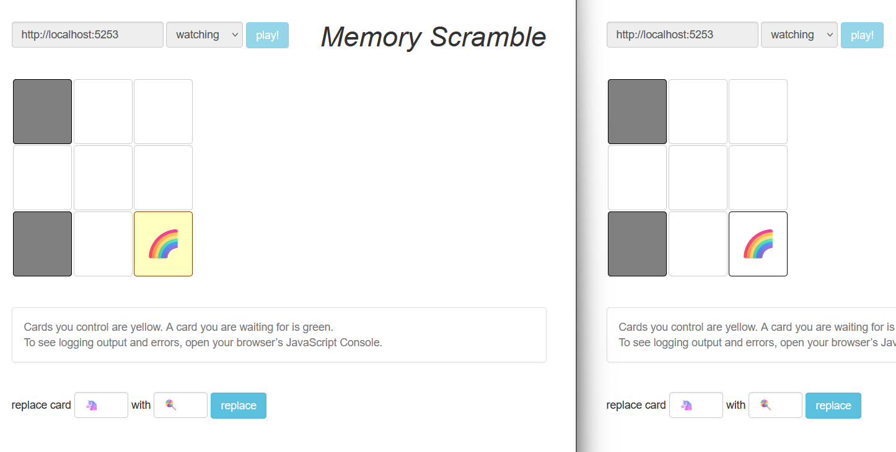
*Player on left owns first card and wants to make a move*

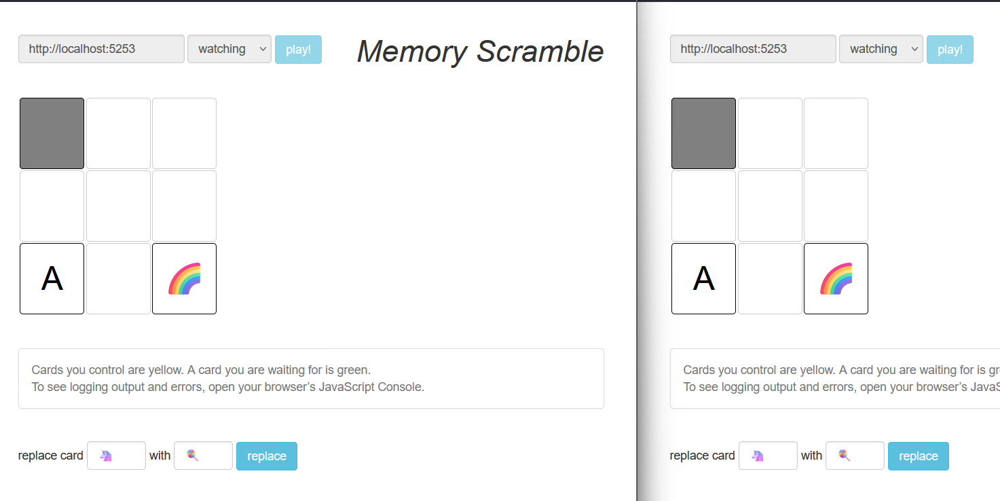
*Player on left selected second card - they didn't match, so player lost control of both cards*

```csharp
else
{
    GiveUpControl(firstPos, toResolve);
    playerState.SetSecondCard(pos);
}
```
The player loses control of both cards, but they remain face up for now.

### Cleanup Rules (3-A and 3-B)

These rules execute when a player makes their next first-card flip, finishing their previous play.

**Rule 3-A: Matched Cards Removal**

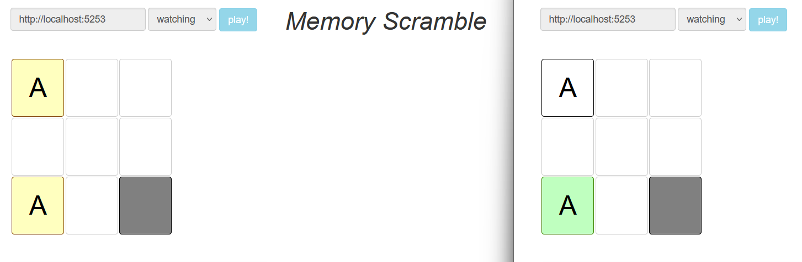
*Player on left owns both matched cards (yellow). Player on right waits (green) for one of the controlled cards.*


*Player on left made another move - matched cards disappeared. Player on right who was waiting got error as the place became empty (Rule 1-A).*

```csharp
if (matched)
{
    RemoveIfPresent(firstPos);
    GiveUpControl(firstPos, toResolve);
    
    RemoveIfPresent(secondPos);
    GiveUpControl(secondPos, toResolve);
}
```
Both cards are removed from the board, and any players waiting for them are notified.

**Rule 3-B: Non-Matched Cards Turn Face Down**

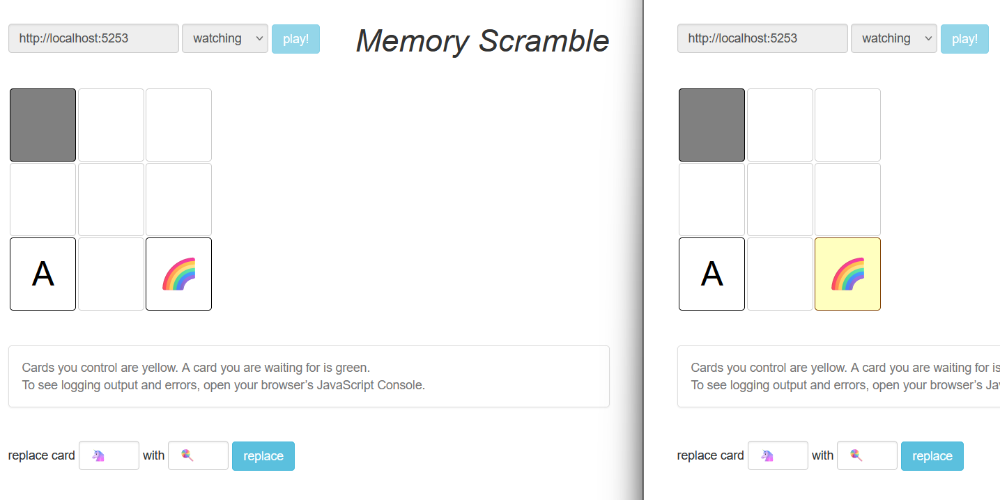
*Player on left picked two non-matching cards and holds reference to them. Player on right controls one of their cards.*

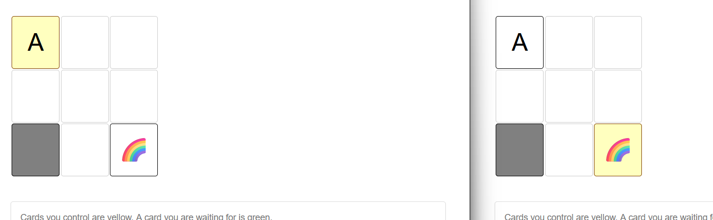
*Player on left made their move - the non-matching cards that aren't controlled turned face down. The card controlled by player on right did NOT turn down.*

```csharp
else
{
    TurnDownIfPossible(firstPos);  // Only if not controlled by another player
    TurnDownIfPossible(secondPos);
}
```
Each card turns face down **only if**:
- The card still exists
- The card is currently face up
- The card is not controlled by another player

This allows other players to see and potentially take control of the cards before they turn face down.

---

## Map Operation

The `Map` operation applies a transformation function to every card on the board, demonstrating functional programming principles in a concurrent environment.

### Specification

```csharp
/// <summary>
/// Applies a transformation function to every card on the board.
/// The function f is applied to each distinct card value, and all cards with that value
/// are replaced with the result. The transformation is applied atomically per card value.
/// Cards that are face-up or controlled remain in their current state after transformation.
/// 
/// The function f must be a mathematical function: calling f(x) multiple times with the same x
/// should always produce the same result. The function may be asynchronous.
/// 
/// While Map is running, other operations may interleave, but the board will remain consistent:
/// if two cards match at the start of Map, no player will observe a state where they don't match
/// during the transformation.
/// </summary>
/// <param name="f">Transformation function that maps a card value to a new card value</param>
/// <returns>A task that completes when all transformations are applied</returns>
public async Task Map(Func<string, Task<string>> f)
```

### Implementation Strategy

The Map operation works in three phases to ensure consistency while allowing concurrency:

1. **Snapshot Phase**: While holding the lock, group all card positions by their current value. This creates a mapping of which positions contain which card values at this moment.

2. **Transformation Phase**: Release the lock and asynchronously transform each distinct card value using the provided function `f()`. This allows other operations to proceed while transformations are computing.

3. **Application Phase**: Reacquire the lock and atomically replace all cards that still have their original value with the transformed value. Cards that changed during transformation are left unchanged.

This ensures that if two cards match at the start of Map, they will both be transformed together, preventing players from ever observing a partially-transformed board state where matching cards don't match.

### Key Properties

**Consistency:** If two cards match at the start, they will always match during the transformation. Players never observe a state where `card1 == "🦄"` and `card2 == "🌈"` when they started as both `"🦄"`.

**Non-Blocking:** While `f()` is computing, other operations can proceed. The lock is only held during snapshot and replacement, not during transformation.

**Atomicity per Value:** All cards with the same original value are replaced in a single atomic step.

**State Preservation:** Face-up/face-down status and player control are unaffected by map.

### Example Use Case

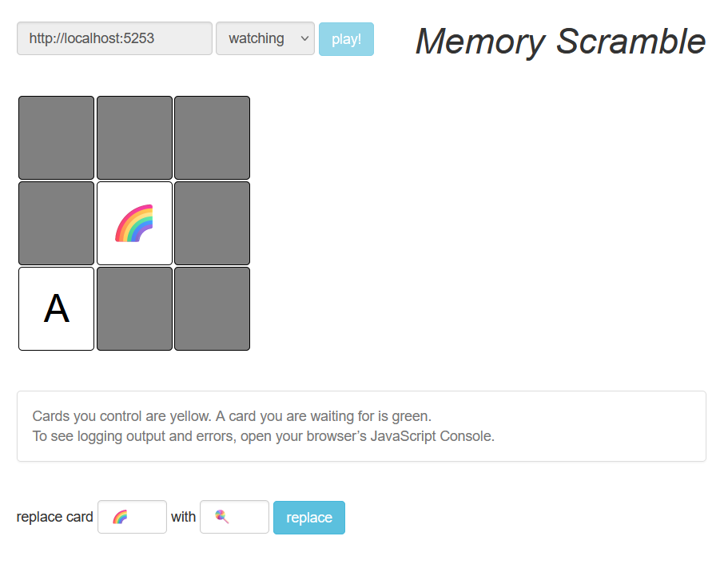
*Board state before applying map transformation*

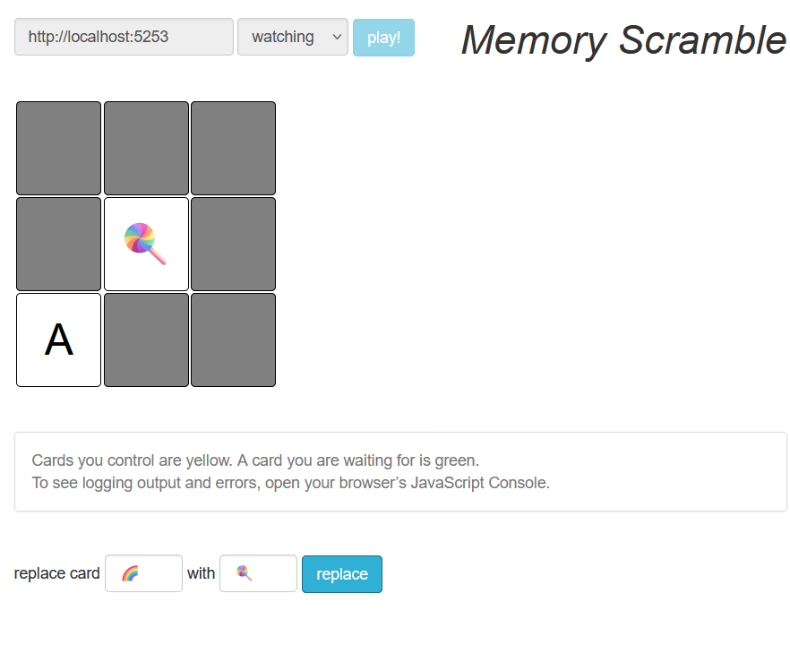
*Board state after map transformation - cards replaced while maintaining face-up/face-down and control states*

```csharp
// Replace all unicorns with rainbows
await board.Map(async card => 
    card == "🦄" ? "🌈" : card
);
```

---

## Watch Operation

The `Watch` operation implements long-polling to notify clients of board changes, enabling a responsive real-time user interface.

### Specification

```csharp
/// <summary>
/// Registers a watcher for the given player and waits for the next board change.
/// A change is any card turning face up/down, being removed, or changing value.
/// Control changes (without visibility changes) do not trigger watchers.
/// 
/// When a change occurs, the watcher is notified with the current board state as seen by the player.
/// Multiple watchers can be registered and will all be notified of the next change.
/// </summary>
/// <param name="playerId">The ID of the player watching the board (must be non-empty)</param>
/// <returns>A task that completes with the board state when a change occurs</returns>
public async Task<string> Watch(string playerId)
```

### Implementation

**Registration:**
```csharp
var watcher = new Deferred<string>();

await _lock.WaitAsync();
try
{
    _watchers[watcher] = playerId;  // Store promise with player ID
}
finally { _lock.Release(); }

return await watcher.Task;  // Wait for notification
```

**Notification:**
```csharp
private async Task NotifyWatchersAsync()
{
    List<(Deferred<string> w, string pid)> snapshot;
    
    await _lock.WaitAsync();
    try
    {
        snapshot = _watchers.ToList();
        _watchers.Clear();  // One-shot notifications
    }
    finally { _lock.Release(); }
    
    // Resolve all watchers with their personalized view
    foreach (var (watcher, playerId) in snapshot)
    {
        var view = await ViewBy(playerId);
        watcher.Resolve(view);  // Promise fulfills, HTTP response sent
    }
}
```

### When Watchers are Notified

**Changes that trigger notifications:**
- ✅ Card turns face up (Rule 1-B, 2-C)
- ✅ Card turns face down (Rule 3-B)
- ✅ Card removed from board (Rule 3-A)
- ✅ Card value changes (Map operation)
- ✅ Board reset

**Changes that do NOT trigger:**
- ❌ Player takes/releases control (if card remains face up)
- ❌ Player waits for a card
- ❌ Flip attempt fails

### HTTP Protocol

The web client uses `watch` instead of polling:

```javascript
// Long-polling watch loop
async function watch() {
    const response = await fetch(`/watch/${playerId}`);
    const boardState = await response.text();
    
    refreshBoard(boardState);  // Update UI
    setTimeout(watch, 1);      // Immediately start next watch
}
```

This provides near-instant updates when any player makes a move, without the overhead of constant polling.

---

## Abstraction Function, Rep Invariant, and Safety from Rep Exposure

Following 6.102 principles, the `Board` ADT includes rigorous documentation of its representation.

### Abstraction Function (AF)

```csharp
// Abstraction function:
//   AF(_grid, _controlledBy, _players, _holds, _watchers) = 
//     A Memory Scramble game board where:
//       - The board has Rows x Columns positions arranged in a grid
//       - Each position (r,c) where 0 <= r < Rows and 0 <= c < Columns either:
//           * Contains a face-down card with value _grid[r,c].Card
//           * Contains a face-up card with value _grid[r,c].Card, 
//             possibly controlled by a player
//           * Is empty (no card) if _grid[r,c].Card is null
//       - Players (identified by their string IDs) may have:
//           * No cards flipped (not in _players, or both FirstCard and SecondCard are null)
//           * One card flipped and controlled (FirstCard set, SecondCard null)
//           * Two cards flipped (both FirstCard and SecondCard set), either:
//             - Matching: player controls both cards
//             - Non-matching: player controls neither card
//       - Some players may be waiting to control specific cards (_holds)
//       - Some players may be watching for board changes (_watchers)
```

The AF maps the concrete representation (cells, dictionaries, semaphores) to the abstract concept of a Memory Scramble game board with concurrent players.

### Rep Invariant (RI)

```csharp
// Rep invariant:
//   - _grid is not null, with dimensions Rows x Columns (both > 0)
//   - Each Cell in _grid is non-null
//   - For each cell: if Card is null, then IsUp is false and cell position is not in _controlledBy
//   - For each cell with non-null Card: Card matches CardRegex (^\S+$)
//   - For each (pos, playerId) in _controlledBy:
//       * pos is valid (0 <= pos.Row < Rows && 0 <= pos.Column < Columns)
//       * _grid[pos].Card is non-null and _grid[pos].IsUp is true
//       * playerId exists as a key in _players
//       * pos appears in _players[playerId].FirstCard or SecondCard
//   - For each (playerId, state) in _players:
//       * playerId is non-empty string
//       * If state.SecondCard is set, state.FirstCard must also be set
//       * If state.FirstCard is set and state.SecondCard is null, 
//         FirstCard must be controlled by playerId in _controlledBy
//   - _lock, _holds, _watchers, _players, _controlledBy are all non-null
```

**CheckRep() Implementation:**

```csharp
private void CheckRep()
{
    Debug.Assert(_grid != null);
    Debug.Assert(Rows > 0 && Columns > 0);
    
    // Verify all cells are non-null
    for (int i = 0; i < Rows; i++)
        for (int j = 0; j < Columns; j++)
            Debug.Assert(_grid[i, j] != null);
    
    // Verify no removed cards are controlled
    foreach (var (pos, _) in _controlledBy)
        Debug.Assert(_grid[pos.Row, pos.Column].Card != null);
    
    // Verify player state consistency
    foreach (var (pid, state) in _players)
    {
        if (state.FirstCard != null && state.SecondCard == null)
            Debug.Assert(IsControlledBy(state.FirstCard.Value, pid));
    }
    
    // ... additional assertions
}
```

`CheckRep()` is called at the end of every operation while holding the lock, ensuring the invariant is maintained.

### Safety from Rep Exposure (SRE)

```csharp
// Safety from rep exposure:
//   - All fields are private and readonly where applicable
//   - _grid is a 2D array of Cell objects; Cell is a private nested class never exposed
//   - ViewBy() and Watch() return strings (immutable) representing board state
//   - ParseFromFile() and ParseFromLines() create new Board instances, not exposing internals
//   - PlayerState is a private nested class, never exposed to clients
//   - All dictionaries (_controlledBy, _players, _holds, _watchers) are private
//     and never returned directly; their contents are only accessed internally
//   - Public methods (Flip, Map, ViewBy, Watch) only accept/return immutable types
//     (string, int, Task<string>, Func<string, Task<string>>)
//   - The only way to observe board state is through ViewBy/Watch which return strings
//   - The only way to mutate board state is through Flip and Map operations,
//     which are synchronized via _lock to maintain invariants
//   - Deferred<T> objects in _holds and _watchers are used internally only for
//     coordination; they are never exposed to clients
```

**Key SRE Mechanisms:**

1. **No Mutable Objects Returned:** All public methods return immutable types (strings) or tasks that resolve to immutable types.

2. **Private Nested Classes:** `Cell` and `PlayerState` are private, preventing external code from accessing or modifying internal state.

3. **Defensive Copying:** The constructor makes defensive copies of arrays:
   ```csharp
   private Board(int rows, int columns, Cell[,] grid, string[] initialCards)
   {
       _grid = new Cell[rows, columns];
       for (int i = 0; i < rows; i++)
           for (int j = 0; j < columns; j++)
               _grid[i, j] = grid[i, j];  // Defensive copy
       
       _initialCards = new string[initialCards.Length];
       Array.Copy(initialCards, _initialCards, initialCards.Length);  // Defensive copy
   }
   ```

4. **Synchronized Access:** All mutations occur under lock, preventing race conditions and ensuring atomicity.

5. **No Reference Leakage:** Dictionaries and collections are never returned; only their derived string representations.

---

## Deployment

The application is deployed on **Render** at: `https://ms.maxim.contact`

**Environment Configuration:**
- **ASPNETCORE_ENVIRONMENT**: Host
- **BaseUrl**: https://ms.maxim.contact
- **GameResetIntervalMinutes**: 5
- **HealthCheckIntervalMinutes**: 13
- **BoardFile**: 10x10.txt

The HealthCheckScheduler prevents the Render instance from sleeping by pinging `/health` every 13 minutes, ensuring the game is always available for multiplayer sessions.

---

## Conclusion

This implementation demonstrates comprehensive understanding of:
- **Concurrent mutable ADTs** with proper synchronization
- **Asynchronous programming** with promises and deferreds
- **Thread-safe design** without deadlocks or race conditions
- **Specification-driven development** per 6.102 requirements
- **Comprehensive testing** with 65 passing tests
- **Production deployment** with Docker and cloud hosting

The game successfully handles 4+ concurrent players making simultaneous moves without crashes, satisfying all requirements for MIT 6.102 Problem Set 4.

---

*Implemented by: Alex*  
*Course: 6.102 — Software Construction, Spring 2025*  
*Language: C# 9.0 / .NET 9.0*